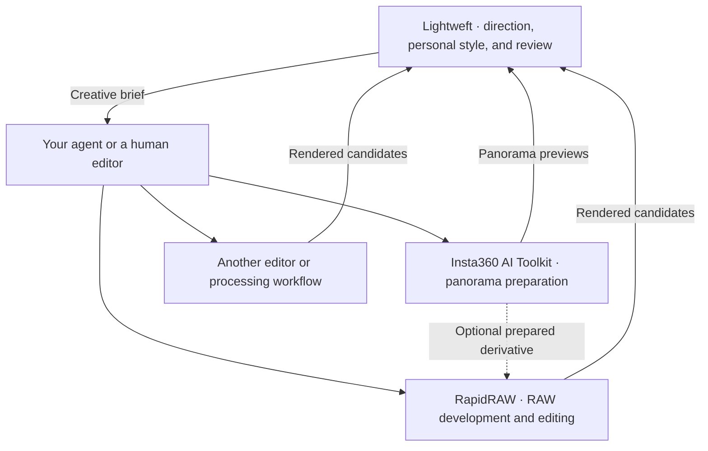

<p align="center">
  
</p>

<h1 align="center">Lightweft — AI Photo Editing Workflow</h1>

<p align="center">
  <a href="skills/photo-edit-master/SKILL.md"></a>
  <a href="#bring-your-favourite-editor"></a>
  <a href="LICENSE"></a>
  <a href=".github/workflows/validate.yml"></a>
</p>

<p align="center">
  <a href="#install-in-one-command">Install</a> ·
  <a href="#what-the-skill-brings">Explore the skill</a> ·
  <a href="https://sheldonxxxx.github.io/Lightweft/">Workflow demos</a> ·
  <a href="#one-workspace-for-review-and-personal-style">Review workspace</a> ·
  <a href="#optional-companion-rapidraw-mcp">RapidRAW companion</a> ·
  <a href="#macos-quick-start">macOS setup</a> ·
  <a href="docs/getting-started.md">Getting started</a> ·
  <a href="docs/ecosystem.md">Ecosystem guide</a>
</p>

---

## An AI workflow for your photo library

**Tell your agent what you want.** Lightweft guides its artistic decisions, helps develop presets tailored to your photos, and provides a workspace for comparing edits and refining them together.

The optional [**RapidRAW MCP companion**](#optional-companion-rapidraw-mcp) gives your agent native tools to inspect RAW photographs, apply edits and masks, and export the results. **Lightweft guides the workflow; RapidRAW performs the edits.** Install and connect the companion separately, or use another editor your agent can operate. Library access comes through separately connected tools, such as Immich in these demos.

[See the AI workflows in action](https://sheldonxxxx.github.io/Lightweft/). In [**Under the Milky Way**](https://sheldonxxxx.github.io/Lightweft/#under-the-milky-way), an agent finds library photos and edits them through RapidRAW MCP. In [**Style Builder**](https://sheldonxxxx.github.io/Lightweft/#style-builder), it studies a sample of one photographer’s library and creates presets tailored to their photos and preferences. Follow the workflow, compare the results, and use the same approach with your own library.

For 360° photographs, the [spherical composition guidance](skills/photo-edit-master/references/spherical.md) distinguishes an immersive edit from choosing a perspective photograph. The [shared review application](review/README.md) supports synchronized spherical comparisons, seam and pole inspection, and viewing-coordinate export alongside ordinary photo review.

## Install in one command

```sh
npx skills add sheldonxxxx/lightweft --skill photo-edit-master
```

Choose your agent when prompted. The [Skills CLI](https://github.com/vercel-labs/skills#readme) supports project installation by default; add `--global` for a user-level installation.

**The skill supplies artistic direction; it needs a connected editor to make actual edits.** Pair it with the **[RapidRAW MCP fork](https://github.com/sheldonxxxx/RapidRAW)**: follow its [MCP setup guide](https://github.com/sheldonxxxx/RapidRAW/blob/main/mcp/README.md) to build the fork with MCP enabled, connect it to your agent, and install the `rapidraw-mcp` execution skill. The command above does not install or connect the editor.

**Or outsource the setup side quest:** give your AI agent this README and say:

> Set up Lightweft and the RapidRAW MCP fork for me. Install both skills, follow the fork's setup guide to build and connect the editor, and verify the MCP connection. Let me know when we're ready for our first photo.

Once your editor is connected, give your agent a photograph and a brief:

> Use photo-edit-master to develop this photograph with my available editor. Choose a clear artistic direction, explain the visible priorities, and protect the relationships that make the scene convincing. Review the finished edit at viewing size and matched native detail.

<details>
<summary><strong>Try a more specific brief</strong></summary>

**Landscape**

> Make the distant ridges and changing weather carry the image. Preserve the feeling of depth and keep the foreground from competing with the light.

**Wildlife**

> Give the animal a clear presence while keeping its habitat meaningful. Check the eyes, fur or feathers, and the transition into the surroundings.

**Nightscape**

> Strengthen the relationship between the stars and this place. Keep faint sky detail believable and make the foreground readable without flattening the night.

**Refine an edit**

> Keep the colour and contrast I liked in the earlier version. Correct the distracting halo, then compare both the affected edge and the whole photograph.

</details>

For manual installation, personal style setup, and a first comparison with your own exports, follow the [getting-started guide](docs/getting-started.md).

## What the skill brings

<table>
<tr>
<td width="50%" valign="top">
<h3>◉ Read the photograph</h3>
<p>Find the image's strongest quality, the obstacle to its impact, and the relationships that give it meaning.</p>
</td>
<td width="50%" valign="top">
<h3>↗ Choose a direction</h3>
<p>Turn a broad brief into visible priorities, a coherent treatment, and clear signs of excessive processing.</p>
</td>
</tr>
<tr>
<td width="50%" valign="top">
<h3>◇ Protect what matters</h3>
<p>Preserve credible light, material texture, atmosphere, context, and the photographer's intention.</p>
</td>
<td width="50%" valign="top">
<h3>◎ Critique the result</h3>
<p>Compare source and candidate, identify the gain and its cost, and refine against the version the photographer valued.</p>
</td>
</tr>
</table>

### One shared philosophy, different photographic relationships

| Genre | What carries the photograph |
| :--- | :--- |
| [Landscape](skills/photo-edit-master/references/landscape.md) | Place, depth, weather, land, and natural structure |
| [Wildlife](skills/photo-edit-master/references/wildlife.md) | An animal's presence, behaviour, and habitat |
| [Nightscapes](skills/photo-edit-master/references/nightscapes.md) | The connection between a starry sky and a terrestrial place |
| [People](skills/photo-edit-master/references/people.md) | Faces, gesture, skin, and relationships among people |
| [Still life](skills/photo-edit-master/references/still-life.md) | Colour, light, texture, food, flowers, and material |

The skill uses selective reading: a shared core plus the reference relevant to the photograph. [Master studies](skills/photo-edit-master/references/master-studies.md) provide deeper context and distinguish testimony, observation, and inference. The guidance contains no fixed slider recipes or mandatory look.

## One workspace for review and personal style

The [local review application](review/README.md) brings edit comparisons, style exploration, denoise review, and detail inspection into one extensible workspace. Agents publish rendered candidates; photographers compare them and save feedback and selections for the next iteration. Start it from this repository with Python 3.10+ on macOS or Linux:

```sh
python3 review/server.py --workspace .local/review --media-root . --port 8765
```

Open `http://127.0.0.1:8765`. Follow the [review guide](review/README.md) to add your images or import an existing review manifest. The app displays existing editor exports; it does not decode RAW files or perform edits itself. For a disposable controls demo, run `python3 review/tests/fixture.py --port 8766` and open [localhost:8766](http://127.0.0.1:8766). [Set review](review/README.md) compares explicit photo sequences; single-image, side-by-side, and wipe views support individual inspections.

Use [photo-style-builder](skills/photo-style-builder/SKILL.md) to explore a personal look with an agent. The master skill supplies a convincing image-specific base; the style builder develops your preferences through rendered alternatives and feedback. Save qualitative preferences as a workspace edit profile, or save a real editor recipe as a preset with provenance and reuse limits. Personal taste stays in your workspace, independently of the shared master skill.

```sh
npx skills add sheldonxxxx/lightweft --skill photo-style-builder
```

[See the Style Builder workflow](https://sheldonxxxx.github.io/Lightweft/#style-builder): an AI agent studies photos from your library, explores editing styles, and creates presets tailored to your photos and preferences. Quiet Story, Amber Days, Garden Reverie, and After Hours demonstrate one personal study. Compare the same base rendering with and without each preset; these example preset files are not bundled with the skill.

## Bring your favourite editor

```text
                               LIGHTWEFT
                      intention · priorities · critique
                                   │
                    Your agent or a human editor
                                   │
               ┌───────────────────┴───────────────────┐
        Your preferred editor                   RapidRAW + MCP
      available controls or API                optional companion
               └───────────────────┬───────────────────┘
                            Render → Review
```

Use the plan in Lightroom, darktable, Photoshop, a command-line workflow, or another editor. Automated execution depends on the controls, API, or separate execution skill available to your agent. **The planning skill is independent of RapidRAW and does not automatically add integrations to other applications.**

## Optional companion: RapidRAW MCP

<p>
  <a href="https://github.com/sheldonxxxx/RapidRAW"></a>
  <a href="https://github.com/sheldonxxxx/RapidRAW/blob/main/mcp/VERIFICATION.md"></a>
</p>

The [**RapidRAW fork**](https://github.com/sheldonxxxx/RapidRAW) is an optional, tested execution companion. Its native MCP bridge lets a vision-capable agent inspect RAW photographs, make reversible edits, build masks, compare versions, run denoising jobs, and export the result through RapidRAW's own processing engine.

| Lightweft | RapidRAW execution skill |
| :--- | :--- |
| Chooses the artistic intention | Translates that intention into native operations |
| Explains what should change and what to protect | Maintains sessions, revisions, masks, and editable state |
| Critiques the rendered photograph | Returns previews, native detail, comparisons, and exports |

Install the companion separately:

```sh
npx skills add sheldonxxxx/RapidRAW --skill rapidraw-mcp
```

**Tested on macOS with Metal and a source-built MCP-enabled binary, plus a recorded Debian/NVIDIA setup. Windows and packaged MCP releases remain untested for this workflow.** The [remote guide](https://github.com/sheldonxxxx/RapidRAW/blob/main/mcp/REMOTE-SSH.md) describes the qualified Linux configuration and its limits. The [verification record](https://github.com/sheldonxxxx/RapidRAW/blob/main/mcp/VERIFICATION.md) separates protocol tests, real native processing, visual checks, and remaining limits.

### macOS quick start

Follow the [RapidRAW MCP setup guide](https://github.com/sheldonxxxx/RapidRAW/blob/main/mcp/README.md) for build prerequisites, enabling the bridge, and connecting your agent. The companion skill and MCP server are separate installations; installing the skill alone does not enable editing tools.

Once connected, give your agent a photograph and ask:

> Use photo-edit-master for artistic direction and rapidraw-mcp for execution. Inspect this photo, choose a treatment, preserve the original, and compare the rendered result before exporting.

RapidRAW owns its build instructions, model setup, and connection troubleshooting. Consult its [execution skill](https://github.com/sheldonxxxx/RapidRAW/tree/main/skills/rapidraw-mcp) for the editing workflow and its [verification record](https://github.com/sheldonxxxx/RapidRAW/blob/main/mcp/VERIFICATION.md) for tested limits.

## Three projects, one connected workflow

**Lightweft is the central entrypoint. RapidRAW and Insta360 AI Toolkit are independent, optional tools.** Each has its own repository, installation, license, and use outside this ecosystem.



| Project | Use it for | Start there |
| :--- | :--- | :--- |
| **Lightweft** · this repository | Direction, style exploration, and shared review with any editor that can supply suitable exports | [Getting started](docs/getting-started.md) |
| **[RapidRAW](https://github.com/sheldonxxxx/RapidRAW)** · independent editor fork | Native RAW processing, reversible edits, masks, denoising, and exports; an optional MCP bridge lets an agent operate the engine | [MCP setup and tested paths](https://github.com/sheldonxxxx/RapidRAW/blob/main/mcp/README.md) |
| **[Insta360 AI Toolkit](https://github.com/sheldonxxxx/insta360-ai-toolkit)** · independent toolkit | Saved-photo stitching, HDR, orientation, Studio DNG workflows, and a standalone panorama viewer | [Choose a processing route](https://github.com/sheldonxxxx/insta360-ai-toolkit#readme) |

**The companion workflows have bounded test evidence.** RapidRAW's MCP records cover macOS/Metal and a specific Linux/NVIDIA setup; Windows and packaged MCP releases remain untested. Insta360's records cover selected INSP processing in Linux containers on Apple Silicon and x86-64 Linux, plus a separate native macOS Studio DNG route. Vendor SDK access is required for the SDK route, and direct SDK DNG stitching did not pass image acceptance. See the [compatibility and evidence guide](docs/ecosystem.md#compatibility-and-evidence) before setting up either tool.

The connection is a workflow through your agent, exported images, recipes, and review manifests. There is no bundled installer or automatic discovery of these tools. You can use Lightweft alone, either companion alone, or all three together.

## For skill authors and workflow builders

The optional [RAW regression toolkit](workflow/README.md) builds a private catalogue from your CR3/DNG inputs and existing previews. It checks hashes, file identity, capture groups, and recorded provenance. It is useful for regression work alongside visual review; it does not score aesthetic quality.

<details>
<summary><strong>Repository map and validation commands</strong></summary>

| Path | Purpose |
| :--- | :--- |
| `skills/photo-edit-master/` | Generic planning and critique skill, with research references |
| `skills/photo-style-builder/` | Collaborative personal style exploration and workspace profiles |
| `docs/` | Getting started, ecosystem responsibilities, and future direction |
| `review/` | Local review server, browser panels, and session contract |
| `workflow/` | Local suite builder, catalogue, verifier, and blank templates |
| `tests/` | Synthetic integrity and portability tests |
| `showcase/` | Approved photo demos and a static gallery |
| `scripts/check_public_repo.py` | Public-source boundaries and common private-data checks |

Python 3.10+; Pillow validates the published JPEGs:

```sh
python3 -m venv .venv
.venv/bin/python -m pip install Pillow==12.2.0
.venv/bin/python -m unittest discover -s tests -v
.venv/bin/python scripts/check_public_repo.py
```

Only approved demo JPEGs belong in `showcase/assets/`. Originals, private library metadata, editing runs, and a separate local RapidRAW checkout stay outside this repository's public source. The banner is original vector artwork, not a sample edit or benchmark result.

</details>

---

<p align="center"><strong>Make what matters more perceptible. Preserve what gives it meaning.</strong></p>
<p align="center">
  <a href="skills/photo-edit-master/SKILL.md">Read the skill</a> ·
  <a href="CONTRIBUTING.md">Contribute</a> ·
  <a href="https://github.com/sheldonxxxx/lightweft/issues">Share feedback</a>
</p>

Original code, documentation, and vector artwork are [MIT licensed](LICENSE). Referenced research and third-party projects retain their own terms. RapidRAW is a separate project under its own AGPL-3.0 license.

Showcase photographs are excluded from the MIT license; their copyright holders reserve all rights. See the [photo terms](showcase/LICENSE).
