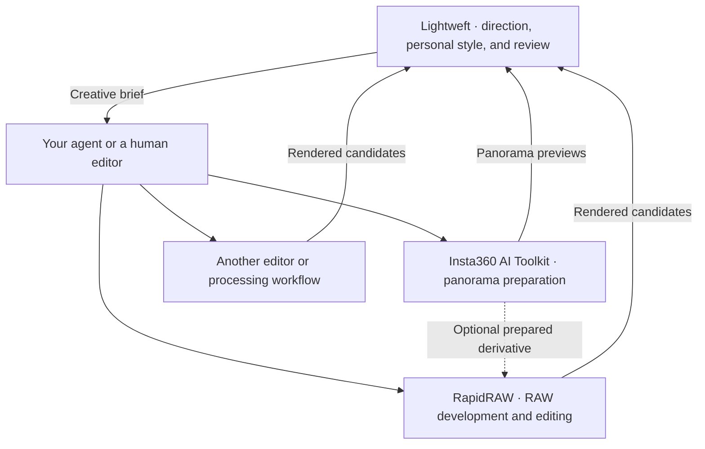

<p align="center">
  
</p>

<h1 align="center">Lightweft</h1>
<p align="center"><strong>Your workspace for AI photo editing.</strong></p>
<p align="center">Artistic direction · Personal style · Visual review · Tools you choose</p>

<p align="center">
  <a href="LICENSE"></a>
  <a href="skills/photo-edit-master/SKILL.md"></a>
  <a href="review/README.md"></a>
  <a href="https://github.com/sheldonxxxx/lightweft/actions/workflows/validate.yml"></a>
</p>

<p align="center">
  <a href="#get-started">Get started</a> ·
  <a href="#three-projects-one-connected-workflow">The ecosystem</a> ·
  <a href="review/README.md">Review guide</a> ·
  <a href="docs/ecosystem.md#where-were-going">Our vision</a>
</p>

## Give every photograph its own direction

**Lightweft brings the creative loop together: understand a photograph, edit with your chosen tools, compare the rendered result, and refine it through feedback.** Its agent skills supply artistic judgment and help develop your personal style. Its local review app gives you and your agent a shared place to inspect the work.

Start here whether you are refining one RAW photograph, exploring several looks, reviewing a set, or working with a full 360° panorama. Lightweft is an open-source workspace for photographers using AI agents and for developers building photo workflows. You bring the agent and editor; Lightweft supplies the direction and review loop.

## Get started

### Install the skill in one command

Install the artistic direction skill with Node.js/npm and the [Skills CLI](https://github.com/vercel-labs/skills#readme):

```sh
npx skills add sheldonxxxx/lightweft --skill photo-edit-master
```

Choose your agent when prompted. **The skill supplies artistic direction; it needs a connected editor to make actual edits.** Pair it with the **[RapidRAW MCP fork](https://github.com/sheldonxxxx/RapidRAW)**: follow its [MCP setup guide](https://github.com/sheldonxxxx/RapidRAW/blob/main/mcp/README.md) to build the fork with MCP enabled, connect it to your agent, and install the `rapidraw-mcp` execution skill. The command above does not install or connect the editor.

**Or outsource the setup side quest:** give your AI agent this README and say:

> Set up Lightweft and the RapidRAW MCP fork for me. Install both skills, follow the fork's setup guide to build and connect the editor, and verify the MCP connection. Let me know when we're ready for our first photo.

Once your editor is connected, give your agent a photograph:

> Use photo-edit-master to find a clear direction for this photograph. Explain what should change and what gives the scene its character. Make the edit with my available editor, then compare the result at viewing size and native detail.

Read the [getting-started guide](docs/getting-started.md) for personal style, manual installation, and other editing options.

### Try the review workspace

With **Python 3.10+ on macOS or Linux**, run the disposable demo:

```sh
git clone https://github.com/sheldonxxxx/lightweft.git
cd lightweft
python3 review/tests/fixture.py --port 8766
```

Open [localhost:8766](http://127.0.0.1:8766). Compare versions, try the wipe and native zoom, choose a look in Style builder, and explore a sphere. The demo uses synthetic patterns to show the controls; it is not a photographic editing showcase. It needs no agent, SDK, Docker, or editor. Stop with **Ctrl+C**; the demo workspace is temporary.

For your own photographs, follow [your first review](docs/getting-started.md#review-your-own-photographs). The app displays editor exports and saves feedback; RAW development and editing happen in your chosen tool.

## What you can do today

| You want to… | Lightweft provides |
| :--- | :--- |
| Make an edit with a clear purpose | [Photo Edit Master](skills/photo-edit-master/SKILL.md): image-specific plans and critique grounded in light, colour, composition, and atmosphere |
| Discover your personal style | [Photo Style Builder](skills/photo-style-builder/SKILL.md): rendered alternatives, feedback, and guidance for workspace profiles or actual editor presets |
| Compare the work, including fine detail | [Photo reviewer and Detail lab](review/README.md): single, side-by-side, and wipe views; matched detail regions; decisions and notes |
| Judge a group or a 360° photograph | [Set and 360° review](review/README.md): explicit sequences, shared looks, synchronized sphere views, seam and pole inspection |
| Improve an editing integration | [Workflow toolkit](workflow/README.md): collection building, provenance checks, and repeatable regression inputs |

The shared philosophy has focused guidance for [landscapes](skills/photo-edit-master/references/landscape.md), [wildlife](skills/photo-edit-master/references/wildlife.md), [nightscapes](skills/photo-edit-master/references/nightscapes.md), [people](skills/photo-edit-master/references/people.md), [still life](skills/photo-edit-master/references/still-life.md), and [spherical photographs](skills/photo-edit-master/references/spherical.md). There is no mandatory look or fixed slider recipe.

## Three projects, one connected workflow

**Lightweft is the central entrypoint. RapidRAW and Insta360 AI Toolkit are independent, optional tools.** Each has its own repository, installation, license, and use outside this ecosystem.



| Project | Use it for | Start there |
| :--- | :--- | :--- |
| **Lightweft** · this repository | Direction, style exploration, and shared review with any editor that can supply suitable exports | [Getting started](docs/getting-started.md) |
| **[RapidRAW](https://github.com/sheldonxxxx/RapidRAW)** · independent editor fork | Native RAW processing, reversible edits, masks, denoising, and exports; an optional MCP bridge lets an agent operate the engine | [MCP setup and tested paths](https://github.com/sheldonxxxx/RapidRAW/blob/main/mcp/README.md) |
| **[Insta360 AI Toolkit](https://github.com/sheldonxxxx/insta360-ai-toolkit)** · independent toolkit | Saved-photo stitching, HDR, orientation, Studio DNG workflows, and a standalone panorama viewer | [Choose a processing route](https://github.com/sheldonxxxx/insta360-ai-toolkit#readme) |

**The companion workflows have bounded test evidence.** RapidRAW's MCP records cover macOS/Metal and a specific Linux/NVIDIA setup; Windows and packaged MCP releases remain untested. Insta360's records cover selected INSP processing in Linux containers on Apple Silicon and x86-64 Linux, plus a separate native macOS Studio DNG route. Vendor SDK access is required for the SDK route, and direct SDK DNG stitching did not pass image acceptance. See the [compatibility and evidence guide](docs/ecosystem.md#compatibility-and-evidence) before setting up either tool.

The connection is a workflow through your agent, exported images, recipes, and review manifests. There is no bundled installer or automatic discovery of these tools. You can use Lightweft alone, either companion alone, or all three together.

## Your photographs, your judgment

The review app serves registered local exports on loopback and stores feedback in your workspace. Your agent or model provider has its own data-handling settings; using local review does not mean every AI interaction stays on your machine.

Keep originals intact and work on editable state or derivatives. Judge the actual rendered image, including the cost of an edit to texture, atmosphere, and scene meaning. Ordinary photographic editing does not authorize generative changes; agree on those explicitly. Preserve the original scene and resolution unless your brief calls for a different output, such as a selected perspective from a sphere.

## Build with Lightweft

Our vision is an **AI photo editing universe with Lightweft at its center**: more tools and photographic workflows connected by clear artistic intent, reviewable results, and your feedback. The current foundation is deliberately modular. Read [the ecosystem and direction](docs/ecosystem.md) for today's boundaries and where contributions can help.

| Resource | Purpose |
| :--- | :--- |
| [Getting started](docs/getting-started.md) | Install skills, review your first pair, and choose optional tools |
| [Review guide](review/README.md) | Panels, manifests, CLI/API, feedback, and extension points |
| [Workflow guide](workflow/README.md) | Build and verify local regression collections |
| [Contributing](CONTRIBUTING.md) | Development checks and contribution boundaries |
| [Changelog](CHANGELOG.md) | Changes to Lightweft |

Questions, workflow ideas, or a reproducible issue? [Share feedback](https://github.com/sheldonxxxx/lightweft/issues).

Original code, documentation, and vector artwork are [MIT licensed](LICENSE). The banner is illustrative vector artwork. Referenced research and third-party projects retain their own terms; RapidRAW uses AGPL-3.0, and Insta360's vendor SDK has separate terms.
