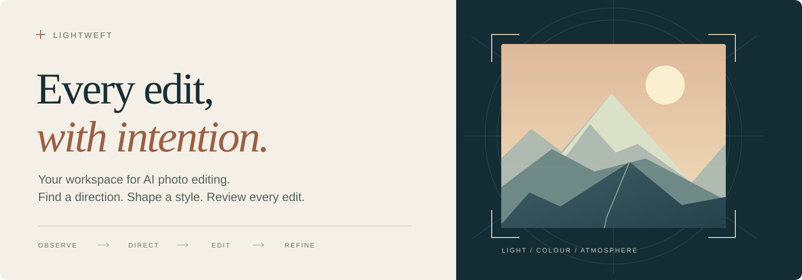

<p align="center">
  
</p>

<h1 align="center">Lightweft — AI Photo Editing Skill</h1>
<p align="center"><em>Thoughtful edits. Any editor.</em></p>
<p align="center"><strong>A tool-agnostic AI photo editing skill for thoughtful, expressive photographs.</strong></p>
<p align="center">Image-specific art direction · Colour and light · Composition · Visual critique</p>

<p align="center">
  <a href="skills/photo-edit-master/SKILL.md"></a>
  <a href="#bring-your-favourite-editor"></a>
  <a href="LICENSE"></a>
  <a href=".github/workflows/validate.yml"></a>
</p>

<p align="center">
  <a href="#install-in-one-command">Install</a> ·
  <a href="#what-the-skill-brings">Explore the skill</a> ·
  <a href="https://sheldonxxxx.github.io/Lightweft/">Photo demos</a> ·
  <a href="#optional-companion-rapidraw-mcp">RapidRAW companion</a> ·
  <a href="#macos-quick-start">macOS setup</a>
</p>

---

## Give every photograph its own direction

**Lightweft helps an AI agent decide what a photograph should become—and judge whether the edit gets there.** It reads the relationships between subject, light, colour, space, and atmosphere, then turns them into a clear edit intention, visible priorities, and details worth protecting.

Use it for RAW photo editing, colour grading, landscape and wildlife photography, nightscapes, portraits, or a second opinion on an existing edit. Pair its artistic judgment with **any photo-editing tool you or your agent can operate**. Your editor supplies the controls; the skill supplies the direction and critique.

For 360° photographs, the [spherical composition guidance](skills/photo-edit-master/references/spherical.md) distinguishes an immersive edit from choosing a perspective photograph. The [shared review application](review/README.md) supports synchronized spherical comparisons, seam and pole inspection, and viewing-coordinate export alongside ordinary photo review.

[Explore the photo demos](https://sheldonxxxx.github.io/Lightweft/), beginning with **Under the Milky Way**: a photographer with an 80,000+ photo collection who kept putting off the edit asked GPT-6 Astra to select galaxy photographs and give them an impactful treatment. Compare what it chose with the finished results. The before images are unadjusted RAW renders from the same editor. See the [showcase guide](showcase/README.md) to add a collection or preview the gallery locally.

## Install in one command

```sh
npx skills add sheldonxxxx/lightweft --skill photo-edit-master
```

Choose your agent when prompted. The [Skills CLI](https://github.com/vercel-labs/skills#readme) supports project installation by default; add `--global` for a user-level installation.

Then give your agent a photograph and a brief:

> Use photo-edit-master to develop this photograph with my available editor. Choose a clear artistic direction, explain the visible priorities, and protect the relationships that make the scene convincing. Review the finished edit at viewing size and matched native detail.

<details>
<summary><strong>Try a more specific brief</strong></summary>

**Landscape**

> Make the distant ridges and changing weather carry the image. Preserve the feeling of depth and keep the foreground from competing with the light.

**Wildlife**

> Give the animal a clear presence while keeping its habitat meaningful. Check the eyes, fur or feathers, and the transition into the surroundings.

**Nightscape**

> Strengthen the relationship between the stars and this place. Keep faint sky detail believable and make the foreground readable without flattening the night.

**Refine an edit**

> Keep the colour and contrast I liked in the earlier version. Correct the distracting halo, then compare both the affected edge and the whole photograph.

</details>

## What the skill brings

<table>
<tr>
<td width="50%" valign="top">
<h3>◉ Read the photograph</h3>
<p>Find the image's strongest quality, the obstacle to its impact, and the relationships that give it meaning.</p>
</td>
<td width="50%" valign="top">
<h3>↗ Choose a direction</h3>
<p>Turn a broad brief into visible priorities, a coherent treatment, and clear signs of excessive processing.</p>
</td>
</tr>
<tr>
<td width="50%" valign="top">
<h3>◇ Protect what matters</h3>
<p>Preserve credible light, material texture, atmosphere, context, and the photographer's intention.</p>
</td>
<td width="50%" valign="top">
<h3>◎ Critique the result</h3>
<p>Compare source and candidate, identify the gain and its cost, and refine against the version the photographer valued.</p>
</td>
</tr>
</table>

### One shared philosophy, different photographic relationships

| Genre | What carries the photograph |
| :--- | :--- |
| [Landscape](skills/photo-edit-master/references/landscape.md) | Place, depth, weather, land, and natural structure |
| [Wildlife](skills/photo-edit-master/references/wildlife.md) | An animal's presence, behaviour, and habitat |
| [Nightscapes](skills/photo-edit-master/references/nightscapes.md) | The connection between a starry sky and a terrestrial place |
| [People](skills/photo-edit-master/references/people.md) | Faces, gesture, skin, and relationships among people |
| [Still life](skills/photo-edit-master/references/still-life.md) | Colour, light, texture, food, flowers, and material |

The skill uses selective reading: a shared core plus the reference relevant to the photograph. [Master studies](skills/photo-edit-master/references/master-studies.md) provide deeper context and distinguish testimony, observation, and inference. The guidance contains no fixed slider recipes or mandatory look.

## One workspace for review and personal style

The [local review application](review/README.md) brings edit comparisons, style exploration, denoise review, and detail inspection into one extensible workspace. Agents publish rendered candidates; photographers compare them and save feedback and selections for the next iteration. Start it from this repository with Python 3.10+ on macOS or Linux:

```sh
python3 review/server.py --workspace .local/review --media-root . --port 8765
```

Open `http://127.0.0.1:8765`. Follow the [review guide](review/README.md) to add your images or import an existing review manifest. The app displays existing editor exports; it does not decode RAW files or perform edits itself.

Use [photo-style-builder](skills/photo-style-builder/SKILL.md) to explore a personal look with an agent. The master skill supplies a convincing image-specific base; the style builder develops your preferences through rendered alternatives and feedback. Save qualitative preferences as a workspace edit profile, or save a real editor recipe as a preset with provenance and reuse limits. Personal taste stays in your workspace, independently of the shared master skill.

```sh
npx skills add sheldonxxxx/lightweft --skill photo-style-builder
```

## Bring your favourite editor

```text
                               LIGHTWEFT
                      intention · priorities · critique
                                   │
                    Your agent or a human editor
                                   │
               ┌───────────────────┴───────────────────┐
        Your preferred editor                   RapidRAW + MCP
      available controls or API                optional companion
               └───────────────────┬───────────────────┘
                            Render → Review
```

Use the plan in Lightroom, darktable, Photoshop, a command-line workflow, or another editor. Automated execution depends on the controls, API, or separate execution skill available to your agent. **The planning skill is independent of RapidRAW and does not automatically add integrations to other applications.**

## Optional companion: RapidRAW MCP

<p>
  <a href="https://github.com/sheldonxxxx/RapidRAW"></a>
  <a href="https://github.com/sheldonxxxx/RapidRAW/blob/main/mcp/VERIFICATION.md"></a>
</p>

[**My RapidRAW fork**](https://github.com/sheldonxxxx/RapidRAW) is the tested execution companion for this skill. Its native MCP bridge lets a vision-capable agent inspect RAW photographs, make reversible edits, build masks, compare versions, run denoising jobs, and export the result through RapidRAW's own processing engine.

| Lightweft | RapidRAW execution skill |
| :--- | :--- |
| Chooses the artistic intention | Translates that intention into native operations |
| Explains what should change and what to protect | Maintains sessions, revisions, masks, and editable state |
| Critiques the rendered photograph | Returns previews, native detail, comparisons, and exports |

Install the companion separately:

```sh
npx skills add sheldonxxxx/RapidRAW --skill rapidraw-mcp
```

**Tested on macOS with Metal and a source-built MCP-enabled binary. Windows has not been tested for this MCP workflow.** Linux and packaged MCP releases are also untested. The [verification record](https://github.com/sheldonxxxx/RapidRAW/blob/main/mcp/VERIFICATION.md) separates protocol tests, real native processing, visual checks, and remaining limits.

### macOS quick start

**1 · Prepare the build tools**

Use macOS 13+ with a Metal-capable GPU, Node.js 22.12+, and [Rust via rustup](https://www.rust-lang.org/tools/install). Install Apple's Command Line Tools if needed:

```sh
xcode-select --install
```

See [Tauri's macOS prerequisites](https://v2.tauri.app/start/prerequisites/#macos) for the native toolchain requirements.

**2 · Build the fork and its MCP server**

```sh
git clone https://github.com/sheldonxxxx/RapidRAW.git
cd RapidRAW

rustup toolchain install 1.98.1 --profile minimal
npm ci
npm run build
CARGO_PROFILE_DEV_DEBUG=0 cargo +1.98.1 build \
  --manifest-path src-tauri/Cargo.toml --features mcp --locked
npm ci --prefix mcp
npm run build --prefix mcp
```

This produces the debug binary used by the tested setup. The `mcp` feature is required; the upstream downloadable app does not include this fork's bridge. Native build dependencies may download on the first build.

**3 · Connect your agent**

Add a stdio server in your agent's MCP settings. For hosts using `mcpServers` JSON, the configuration has this shape:

```json
{
  "mcpServers": {
    "rapidraw": {
      "command": "/absolute/path/to/node",
      "args": [
        "/absolute/path/to/RapidRAW/mcp/dist/index.js",
        "--binary", "/absolute/path/to/RapidRAW/src-tauri/target/debug/RapidRAW",
        "--workspace", "/absolute/path/to/rapidraw-photo-jobs"
      ]
    }
  }
}
```

Replace the examples with real absolute paths; `command -v node` locates Node. Use the actual Cargo output location if you set `CARGO_TARGET_DIR`. Keep the job workspace separate from your originals. Other MCP hosts may use a different configuration format with the same command and arguments.

Restart or reconnect your agent, then ask it to call **`rapidraw_capabilities`**. Installing the skill and connecting the MCP server are separate steps. Local AI tools may need models installed through the bridge; ordinary grading and geometric masks can work without them.

**4 · Make your first edit**

> Use photo-edit-master for artistic direction and rapidraw-mcp for execution. Inspect this photo, choose a treatment, preserve the original, and compare the rendered result before exporting.

For connection recovery, model setup, and detailed test commands, see the fork's [MCP guide](https://github.com/sheldonxxxx/RapidRAW/blob/main/mcp/README.md) and [execution skill](https://github.com/sheldonxxxx/RapidRAW/tree/main/skills/rapidraw-mcp).

## For skill authors and workflow builders

The optional [RAW regression toolkit](workflow/README.md) builds a private catalogue from your CR3/DNG inputs and existing previews. It checks hashes, file identity, capture groups, and recorded provenance. It is useful for regression work alongside visual review; it does not score aesthetic quality.

<details>
<summary><strong>Repository map and validation commands</strong></summary>

| Path | Purpose |
| :--- | :--- |
| `skills/photo-edit-master/` | Generic planning and critique skill, with research references |
| `skills/photo-style-builder/` | Collaborative personal style exploration and workspace profiles |
| `review/` | Local review server, browser panels, and session contract |
| `workflow/` | Local suite builder, catalogue, verifier, and blank templates |
| `tests/` | Synthetic integrity and portability tests |
| `showcase/` | Approved photo demos and a static gallery |
| `scripts/check_public_repo.py` | Public-source boundaries and common private-data checks |

Python 3.10+; Pillow validates the published JPEGs:

```sh
python3 -m venv .venv
.venv/bin/python -m pip install Pillow==12.2.0
.venv/bin/python -m unittest discover -s tests -v
.venv/bin/python scripts/check_public_repo.py
```

Only approved demo JPEGs belong in `showcase/assets/`. Originals, private library metadata, editing runs, and a separate local RapidRAW checkout stay outside this repository's public source. The banner is original vector artwork, not a sample edit or benchmark result.

</details>

---

<p align="center"><strong>Make what matters more perceptible. Preserve what gives it meaning.</strong></p>
<p align="center">
  <a href="skills/photo-edit-master/SKILL.md">Read the skill</a> ·
  <a href="CONTRIBUTING.md">Contribute</a> ·
  <a href="https://github.com/sheldonxxxx/lightweft/issues">Share feedback</a>
</p>

Original code, documentation, and vector artwork are [MIT licensed](LICENSE). Referenced research and third-party projects retain their own terms. RapidRAW is a separate project under its own AGPL-3.0 license.

Showcase photographs are excluded from the MIT license; their copyright holders reserve all rights. See the [photo terms](showcase/LICENSE).
